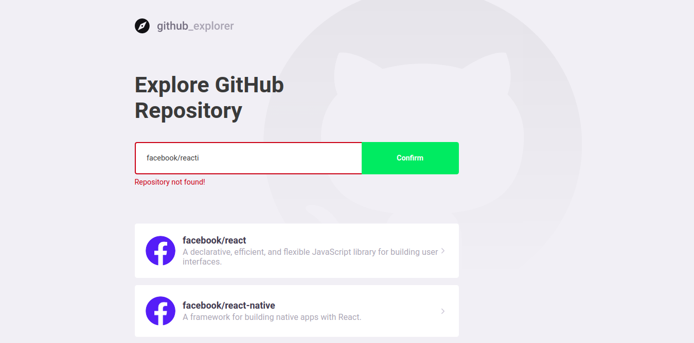
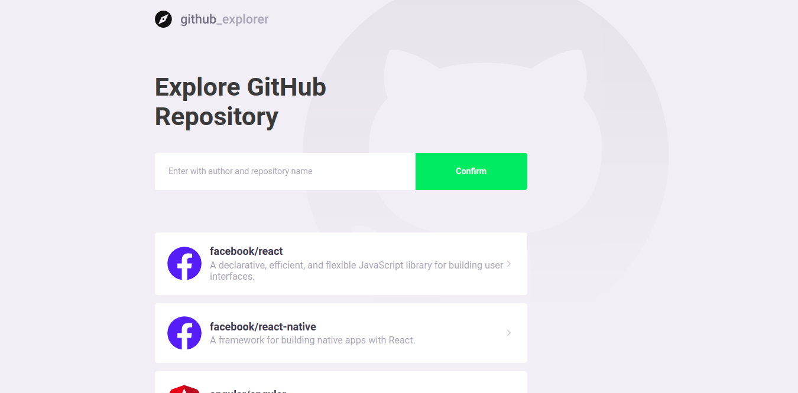
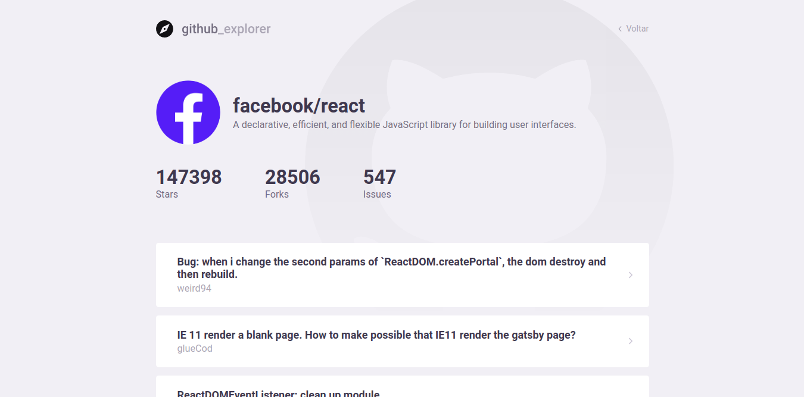

<h3 align="center">
  ReactJS GitHub Explorer
</h3>

## :rocket: About the project

Application developed with ReactJS, TypeScript, Axios, Styled Components using the GitHub API for listing Repositories and Issues.
The layout was created following the guidelines of Design, which established the format, colors, font patterns and characteristics of the visual identity.
The two pages being the main one with a validated field where the owner plus the repository will be informed.

For the installation, just make the clone using the command: https://github.com/alfjuniorbh/github-explorer, access the directory and run the yarn command to install the dependencies.
It is important to have a previously configured environment for it to work.

Below is a preview of how the application looks.

